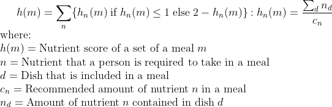
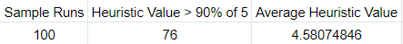

# DaiET

DaiET is an app the uses the 
[Greedy Search Algorithm](https://en.wikipedia.org/wiki/Greedy_algorithm) to create a nutritionally balanced meal set consisting of a breakfast, lunch, and dinner based on a person's age and sex. The data set used for the project is generated by Food.com and is distributed in [Kaggle](https://www.kaggle.com/datasets/irkaal/foodcom-recipes-and-reviews).

This project is developed by:
* **J.D. Amon** (THW)
* **I.C. Caringal** (THV)
* **M.L. Martinez** (THU)
* **J. Tsang** (THV)

## Prerequisites
The following packages are required for the project
1. numpy 1.22.4
2. pandas 1.4.2

To run the progam, enter `python3 gui.py` or `python3 cli.py`

## Table of Contents
* [Materials and Methods](#materials-and-methods)
  * [Data Collection and Preprocessing](#data-collection-and-preprocessing)
  * [Heuristic Function](#heuristic-function)
* [Code Outline](#code-outline)
* [Results](#results)
  * [Performance Measure](#performance-measure)
  * [Greedy Search vs Depth-First Search Comparison](#greedy-search-vs-depth-first-search-comparison)

## Materials and Methods

### Data Collection and Preprocessing
As stated previously, the data set was obtained from https://www.kaggle.com/datasets/irkaal/foodcom-recipes-and-reviews. The following steps were done as part of the preprocessing stage:
* Recipes that were not part of `Breakfast, Lunch/Snacks (the category used in place of Lunch), One Dish Meal (alternative to Dinner)` were deleted. This is to reduce the time taken for the program to search for meal combinations.
* Recipes with missing values in `Calories, Carbohydrate, Fat, Protein, Fiber, or RecipeServings` were deleted. Only these values are taken into account by the program for determining the nutritional value of the selected meals. `RecipeServings` is essential for standardizing the amount of each dish in the dataset to one person. 
* Unescessary columns that are not used for the project, such as `AuthorID, AuthorName, AgregatedRating, etc.`, were dropped in the preprocessing stage.

The processed data set can be found [Here](https://github.com/jltsang/DaiET/blob/main/csv_files/recipes.csv)

### Heuristic Function
The heuristic function is given by the following equation:
  
The heuristic for each nutrient is the normalized “closeness” of the nutritional value of the total dish from the recommended nutritional value given a person’s age and gender, as described in the `Philippine Dietary Reference Intakes 2015 tables` and grows closer to 1 as the total nutritional value for that nutrient grows closer to the recommended value and farther if that value is exceeded.

A balanced meal with the exact recommended nutritional values would have a heuristic value of *n*, where *n* is the number of nutrient inputs. Since obtaining the exact amount of recommended values in a generated meal set is improbable, meal sets that are in the range of 90% of the maximum value *n* is considered optimal.

## Code Outline
The program consists mainly of four parts:
* loadrecipes.py
  * A loadrecipes() function that pre-processes and loads the recipes from the database. This is done by loading a CSV file containing the recipes and dropping all of the unused columns and invalid rows as described in the [Data Collection and Preprocessing stage](#data-collection-and-preprocessing-stage).
* users.py
  * A Users class that stores the age and sex of the user, as well as computes the recommended nutritional value for that user's age and sex based on the Philippine Dietary Reference Intakes 2015 Summary Tables.
* cli.py
  * A user interface that allows a user to input their age and sex, generate a balanced set of meals, and view the set of meals generated and their nutritional values through the command lline.
* searchmeal.py
  * The search function search_meal() that takes the user information, the loaded recipes, and an optional first meal as arguments and returns a "balanced" set of meals that should have a total nutritional value close to the recommended nutritional values. The operation of this function is described below.

The search function uses a greedy approach to searching for a balanced meal by prioritizing the meal that best lowers the "distance" of the nutrient values of the current set of recipes including that meal from the recommended nutrient values for a user, thus reducing the complexity of the search from an exponential `O(n^d)` for number of categories d and number of meals in a category n to a linear `O(dn)` or simply `O(n)`. The function first takes the user data, the loaded recipe data, the list of nutritient types being measured (currently set to `Calories, Carbohydrates, Fat, Protein, and Fiber`), the list of recipe categories used (set to Breakfast, Lunch/Snacks, and One Dish Meal, in that order), and the starting recipe taken from the first recipe category in the list, if any. If no starting recipe is present, a recipe is randomly selected from the first category in the recipe category list. In either case, this recipe is placed in a list of meals selected as the sole entry.
For each subsequent category in the list, the program initializes a "max_heuristic" variable to 0 with a corresponding "max_index" variable, then iterates over each recipe and computes for the heuristic function.
  
The program then compares the result with the `max_heuristic` variable and checks if it is larger, that is, if the meal is closer to the recommended nutritional values, and if so, replaces the `max_heuristic` and `max_index` with the current meal's heuristic and index. Once all meals in that category have been checked, the `max_index` value now refers to the meal in that category that mazimized the heuristic once added to the current set of meals. That meal is then added to the current set of meals, and the next category in the list is then searched. After all categories have been searched, the program returns the set of meals selected, the total nutrient values for each nutrient in the set of meals, and the heuristic value for that meal set.

## Results

### Performance Measure
A search algorithm can be classified as optimal, suboptimal or neither based on its solution. As stated previously when discussing the heuristic function, for a solution to be considered passed, it must have a heuristic value with only at most 10% difference from the perfect value.

The project can be said to be optimal if it is able to create `75 out of 100` meal plans consisting of a breakfast, lunch, dinner, with a heuristic value of at least `90% of the perfect score` from a random sampling, wherein randomized parameters of age and sex are given as input. A random starting meal was also supplied to the search function for each run.

Looking at the results of the test, the program was able to pass the test and provide `76/100` meal plans with satisfactory nutrient values. Additionally, the average heuristic value of all the runs is `4.58074846`, indicating that the average count also passes the test.

  

Complete details of the results of the 100 runs (input parameters, meal names, total nutrient values, heuristic score) can be found in the csv file, [modelperformance](https://github.com/jltsang/DaiET/blob/main/csv_files/modelperformance.csv).

### Greedy Search vs Depth-First Search Comparison

To compare model performance, an uninformed search Depth First Search (DFS) version of the model without heuristics was created. It uses the same input parameters as the informed search model to determine the meal set with the best score by testing each combination of dishes from the 2nd and 3rd dish sets. 

The comparison was done on a smaller data set since DFS runs with a time complexity of `O(nm)`, where *n* is the number of lunch recipes and *m* is the number of dinner recipes. If done on the complete data set, the dfs would take an unusally long time. 

Therefore, comparison was done with a limited recipe data set consisting of `500 `recipes per category, sacrificing the overall performance measure of both algorithms with the lack of recipes in order to accomplish a comparison test in a manageable amount of time.

  

Results between the uninformed and informed search model are compared to measure performance and optimality. The heuristic function implemented on the Greedy Search was used on the results of the DFS in order to simplify comparison.

The following plot shows the results of both models. Looking at the results, we can observe that the DFS model has a better optimality than the Greedy search. This is  to be expected since DFS, as an uninformed search, tested all possible outcomes before choosing the best one. The Greedy Search Model sacrifices some optimality in exchange for a much faster runtime of `O(n+m)`.

Complete details of the results of the 100 runs (input parameters, meal names, total nutrient values, heuristic score) can be found their respective csv files, [Greedy Search](https://github.com/jltsang/DaiET/blob/main/csv_files/searchresults.csv) and [DFS](https://github.com/jltsang/DaiET/blob/main/csv_files/uninformed_searchresults.csv).
